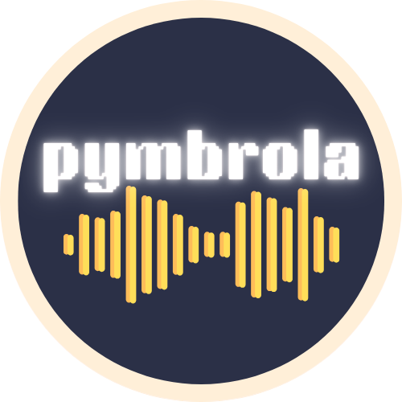

# pymbrola<a href="https://neurodevco.github.io/pymbrola"></a>


[](https://pypi.org/project/mbrola)
[](https://pypi.org/project/mbrola)


-----

A Python interface for the [MBROLA](https://github.com/numediart/MBROLA) speech synthesizer, enabling programmatic creation of MBROLA-compatible phoneme files and automated audio synthesis. This module validates phoneme, duration, and pitch sequences, generates `.pho` files, and can call the MBROLA executable to synthesize speech audio from text-like inputs.

> **References:**
> Dutoit, T., Pagel, V., Pierret, N., Bataille, F., & Van der Vrecken, O. (1996, October).
> The MBROLA project: Towards a set of high quality speech synthesizers free of use for non commercial purposes.
> In Proceeding of Fourth International Conference on Spoken Language Processing. ICSLP'96 (Vol. 3, pp. 1393-1396). IEEE.
> [https://doi.org/10.1109/ICSLP.1996.607874](https://doi.org/10.1109/ICSLP.1996.607874)
You can install **pymbrola** from the [PyPi](https://pypi.org/project/mbrola/) repository using `pip <https://pypi.org/project/mbrola/>`__ or `uv <https://docs.astral.sh/uv/getting-started/installation/>`__:

.. code-block:: bash

   pip install mbrola # pip installation
   uv add mbrola      # uv installation

In either case, you will need Python>=3.10. To synthesise audios via MBROLA, you will need to download it and compile it. The **pymbrola** package has functions for this. This will download MBROLa from https://github.com/numediart/MBROLA to you home folder `~/.mbrola` and compile it.

```python
import mbrola

mbrola.install_mbrola()
```

> [!IMPORTANT]
>MBROLA is currently available only on Linux-based systems like Ubuntu, or on Windows via the `Windows Subsystem for Linux (WSL) <https://learn.microsoft.com/en-us/windows/wsl/install>`_. Native Windows and macOS are not yet compatible with the **pymbrola** package.

Finally, you will need to download some MBROLA voices from https://github.com/numediart/MBROLA-voices. These voices will be automatically downloaded and found by **pymbrola** at `~/.mbrola/Voices`:

```python
mbrola.install_voice("it4")  # install it4 voice
mbrola.install_voice(["it4", "fr4"])  # install several voices
mbrola.install_voice()  # install all voices (~534M)
```

> [!TIP]
> A [Docker image](https://hub.docker.com/repository/docker/gongcastro/mbrola/general) of Ubuntu 22.04 with a ready-to-go installation of MBROLA is available, for convenience.

## Installation

MBROLA is currently available only on Linux-based systems like Ubuntu, or on Windows via the [Windows Susbsystem for Linux (WSL)](https://learn.microsoft.com/en-us/windows/wsl/install). Install MBROLA in your machine following the instructions in the [MBROLA repository](https://github.com/numediart/MBROLA). If you are using WSL, install MBROLA in WSL. After this, you should be ready to install **pymbrola** using pip.

```bash
pip install mbrola
```

## Usage

```python
import mbrola

# Create an MBROLA object
caffe = MBROLA(
    phon=["k", "a", "f", "f", "E1"],
    durations=100,  # or [100, 120, 100, 110]
    pitch=[100, [200, 50, 200], 100, 100, 200],
)

# Display phoneme sequence
print(caffe)

# Export PHO file
caffe.export_pho("caffe.pho")

# Synthesize and save audio (WAV file)
caffe.make_sound("caffe.wav", voice="it4")
```

The module uses the MBROLA command line tool under the hood. Ensure MBROLA is installed and available in your system path, or WSL if on Windows.


## License

`pymbrola` is distributed under the terms of the [MIT](https://spdx.org/licenses/MIT.html) license.

## Supported by

Funded by the European Union. Views and opinions expressed are however those of the author(s) only and do not necessarily reflect those of the European Union or the European Research Council Executive Agency (ERCEA). Neither the European Union nor the granting authority can be held responsible for them. This work is supported by the ERC StG 101115991 (GALA) awarded to Chiara Santolin


